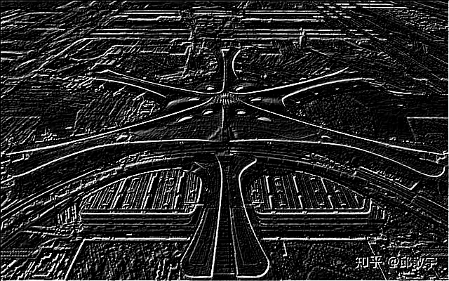
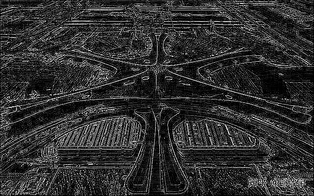

# 卷积算法实践

## 1. 实验目标

根据图像卷积公式，实现 C++ 函数用于图像卷积

## 2. 实现方案

### 2.1 测试环境

* 系统：ubuntu 22.04

### 2.2 具体方案

1. 搜集常用卷积核
2. 使用 openCV 对图像数据进行读入
3. 使用编写的图像卷积函数对图像进行卷积，

* 使用公式为

$$ f(x,y) = \sum_{m=-{a_x}}^{a_x} \sum_{n=-{a_y}}^{a_y} f(x+m, y+n) \times K(m+a_x, n+a_y), $$

其中，

$$ a_x = \left\lfloor{kernel.width \over 2} \right\rfloor 
,  a_y = \left\lfloor{kernel.height \over 2} \right\rfloor $$

* 搜集卷积核有：

1. 均值滤波卷积核：

$$
\left[
\begin{matrix}
1 \over 9 & 1 \over 9 & 1 \over 9 \\
1 \over 9 & 1 \over 9 & 1 \over 9 \\
1 \over 9 & 1 \over 9 & 1 \over 9
\end{matrix}
\right]
$$

2. 高斯模糊卷积核：
    
$$
\left[
\begin{matrix}
1 \over 16 & 2 \over 16 & 1 \over 16 \\
2 \over 16 & 4 \over 16 & 2 \over 16 \\
1 \over 16 & 2 \over 16 & 1 \over 16
\end{matrix}
\right]
$$

3. 锐化卷积核：
    
$$
\left[
\begin{matrix}
-1 & -1 & -1 \\
-1 &  9 & -1 \\
-1 & -1 & -1
\end{matrix}
\right]
$$

4. Sobel X方向卷积核：
    
$$
\left[
\begin{matrix}
-1 & 0 & 1 \\
-2 & 0 & 2 \\
-1 & 0 & 1
\end{matrix}
\right]
$$

5. Sobel Y方向卷积核：
    
$$
\left[
\begin{matrix}
-1 & -2 & -1 \\
 0 &  0 &  0 \\
 1 &  2 &  1
\end{matrix}
\right]
$$

6. 左上Sobel卷积核：
    
$$
\left[
\begin{matrix}
 2 &  1 &  0 \\
 1 &  0 & -1 \\
 0 & -1 & -2
\end{matrix}
\right]
$$

7. 右上Sobel卷积核：
    
$$
\left[
\begin{matrix}
 0 &  1 &  2 \\
-1 &  0 &  1 \\
-2 & -1 &  0
\end{matrix}
\right]
$$

8. 拉普拉斯卷积核：
    
$$
\left[
\begin{matrix}
 0 & -1 &  0 \\
-1 &  4 & -1 \\
 0 & -1 &  0
\end{matrix}
\right]
$$

9. 8连通拉普拉斯卷积核：
    
$$
\left[
\begin{matrix}
 1 &  1 &  1 \\
 1 & -8 &  1 \\
 1 &  1 &  1
\end{matrix}
\right]
$$

10. 浮雕卷积核：
    
$$
\left[
\begin{matrix}
-2 & -1 &  0 \\
-1 &  1 &  1 \\
 0 &  1 &  2
\end{matrix}
\right]
$$

11. 另一种浮雕卷积核：
    
$$
\left[
\begin{matrix}
-1 & -1 &  0 \\
-1 &  0 &  1 \\
 0 &  1 &  1
\end{matrix}
\right]
$$

12. Prewitt X方向卷积核：
    
$$
\left[
\begin{matrix}
-1 &  0 &  1 \\
-1 &  0 &  1 \\
-1 &  0 &  1
\end{matrix}
\right]
$$

13. Prewitt Y方向卷积核：
    
$$
\left[
\begin{matrix}
-1 & -1 & -1 \\
 0 &  0 &  0 \\
 1 &  1 &  1
\end{matrix}
\right]
$$

14. Prewitt 左上卷积核：
    
$$
\left[
\begin{matrix}
 1 &  1 &  0 \\
 1 &  0 & -1 \\
 0 & -1 & -1
\end{matrix}
\right]
$$

15. Prewitt 右上卷积核：
    
$$
\left[
\begin{matrix}
 0 &  1 &  1 \\
-1 &  0 &  1 \\
-1 & -1 &  0
\end{matrix}
\right]
$$

16. 高通卷积核：
    
$$
\left[
\begin{matrix}
-1 & -1 & -1 \\
-1 &  8 & -1 \\
-1 & -1 & -1
\end{matrix}
\right]
$$

17. Scharr X方向卷积核：
    
$$
\left[
\begin{matrix}
-3 &  0 &  3 \\
10 &  0 & 10 \\
-3 &  0 &  3
\end{matrix}
\right]
$$

18. Scharr Y方向卷积核：
    
$$
\left[
\begin{matrix}
-3 & -10 & -3 \\
 0 &   0 &  0 \\
 3 &  10 &  3
\end{matrix}
\right]
$$

19. LoG卷积核（Laplacian of Gaussian）：
    
$$
\left[
\begin{matrix}
 0 &  0 &  1 &  0 &  0 \\
 0 &  1 &  2 &  1 &  0 \\
 1 &  2 & -16 &  2 &  1 \\
 0 &  1 &  2 &  1 &  0 \\
 0 &  0 &  1 &  0 &  0
\end{matrix}
\right]
$$

## 3. 实现结果

1. 均值滤波卷积核：

 

均值滤波卷积核对图像起到了模糊作用，边缘变模糊了。

2. 高斯模糊卷积核：

 

相对于同样大小的均值滤波卷积核，高斯滤波卷积核对图像的模糊作用较弱。

3. 锐化卷积核：

 

图像的边缘变得锐利。

4. Sobel X方向卷积核：

 

可以看到与X方向垂直的边缘变得极为明显，而倾斜的边缘均没有垂直的边缘灰度值高。

5. Sobel Y方向卷积核：

同样地，与Y方向垂直的边缘变得极为明显，而与Y方向平行的边缘甚至没有检出。

6. 左上Sobel卷积核：

 

在两种方向上做了折中，对各种方向的边缘，检测效果较为良好。

7. 右上Sobel卷积核：

 

同上。

8. 拉普拉斯卷积核：

 

图像较为暗淡，但边缘检测效果良好，边缘较细。

9. 8连通拉普拉斯卷积核：

 

去除了上文拉普拉斯卷积核图像较为暗淡的缺点，保留了边缘较细的优点。

10. 浮雕卷积核：

 

11. 另一种浮雕卷积核：

 

12. Prewitt X方向卷积核：

 

相对于同方向的 sobel 卷积核，Prewitt X方向卷积核检出的边缘较细。

13. Prewitt Y方向卷积核：

 

同上理。

14. Prewitt 左上卷积核：

 

同样结合了X、Y两个方向，检测效果良好。

15. Prewitt 右上卷积核：

 

同上

16. 高通卷积核：

 

通过去除图片低频信息得到的边缘检测效果，相比前面提到的卷积核，边缘检测后杂边较多，实际应用需要强力的滤波手段。

17. Scharr X方向卷积核：

 

杂边更多，实际应用可能会耗费大量资源用于去除杂边，个人认为如无需求不推荐使用此种边缘检测卷积核。

18. Scharr Y方向卷积核：

 

同上

19. LoG卷积核（Laplacian of Gaussian）：

 

5x5的卷积核，依然有杂边多、图片不够干净等缺点，实际应用仍需强力滤波手段。

## 4. 收获心得

通过此次实验，我认识到了卷积算法在图像处理领域的作用，并对比了不同卷积核的作用。
